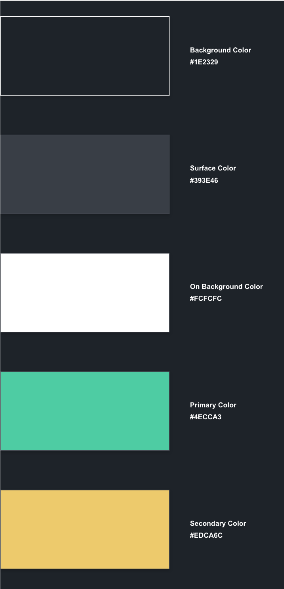
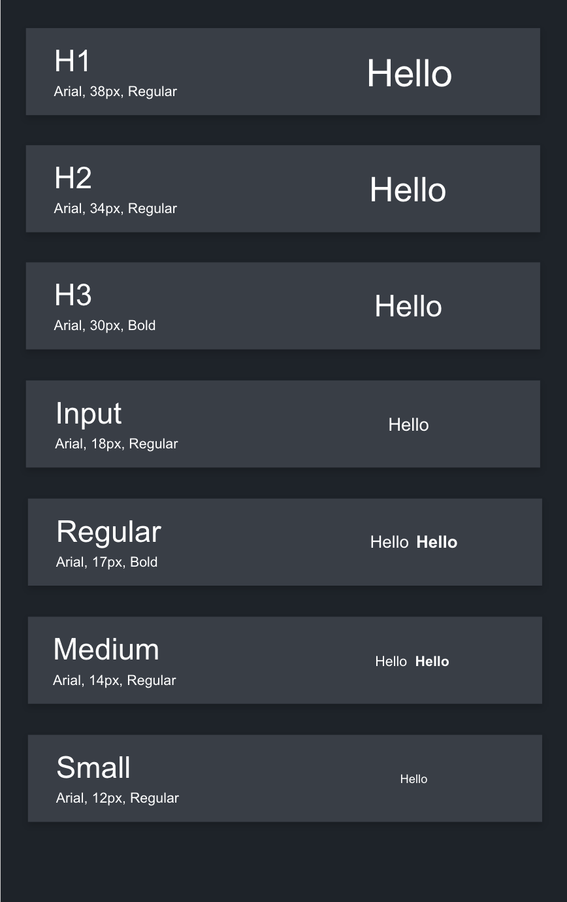
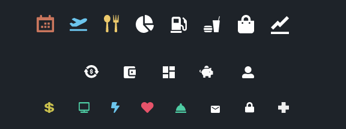
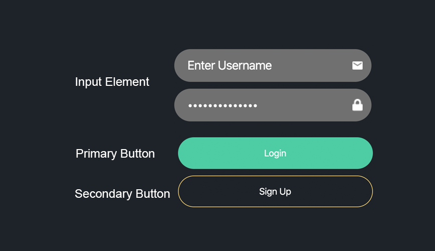
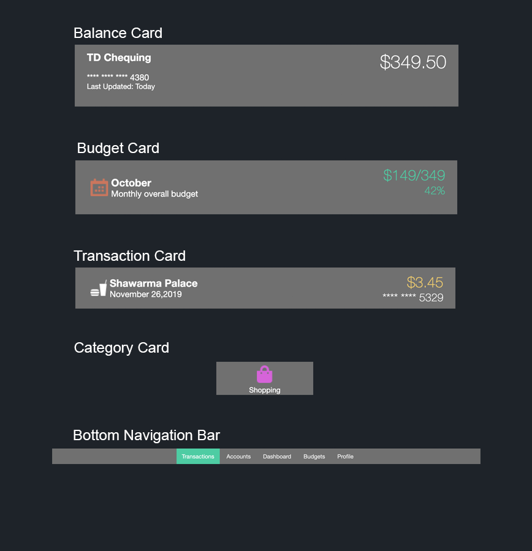

# Wealth-X

A new method of tracking personal finance. Data driven and a clean beautiful interface. Built using NodeJS, React-Native. Class project for CSI3140 with Andrew Forward.

## Main Idea
Create a unified user experience to give a total overview on a users financial health. Allow users to link their institutional accounts, view their balances and owings, manage their budgets and subscriptions.

## Phase 1 - Scope
### 1.1 Accounts Overview
* Allow users to connect their bank account and other institutional accounts to the application
* Gives them a overview of their depository accounts as well as their balances - net worth
### 1.2 Budget Planner
* Allows them to create a budget, split into daily intervals that updates real-time based on bank transactions
* App will allow the user to see their spending habits using categories and get insights into their spendings

## Course Goals 
For the purpose of this course I believe 1.1 will be able to be implemented fully. I do not think 1.2 will be able to be completed within just the 4 months but I can have some of the backend work done since it is usually the front end which takes the most time.

Currently some of the backend work has been done like logging in with a JWT, getting user account info through REST and getting some transactions data. Also some basic CRUD. This has set me up to work on creating a MVP of the client side application which will be built using ReactNative which is perfect for this course since it is basically javascript HTML.

I have also created some UX mockups using AdobeXD which I will translate into HTML/CSS for Deliverable 1 and then work on building out throughout the term. I don't think I'll be able to build out the full app since the scale is very big but at least some core functionality for the purpose of this course.

## Students
Zarif Shahriar, 8177206
Pasoon Azimi, 8215497

## Project Deliverables
### Deliverable 1 - Project Definition
### Deliverable 2 - Project Mockups
### Deliverable 3 - Technology Landspace
### Deliverable 4 - Features
### Deliverable 5 - Version 1.0 of Application

## WIKI 
More information on the project archeticture can be found on the Wiki.

## Installation and Deployment Instructions (Getting Started)

Clone the repo into your workspace,

Install watchman and react-native,

`brew install watchman`

`sudo npm install -g react-native-cli`

If you are on Windows download and install Android studio,

If you are on Mac download and install Xcode, and install the command line tools,

`xcode-select --install`

Go into xcode preferences -> Locations and make sure xcode version is shown beside command line tools,

Cd into wealth-OS-server,

`npm install`

`npm start`

Cd into wealth-OS-app,

`npm install`

`npm start`

Cd into ios,  

`pod update`

`pod install`

Cd into wealth-OS-app,

`react-native run-ios` or `react-native run-android`

## UI Design System

### Color Palette

### Fonts and Type Scale

### Icons

### Buttons and Form Elements

### UI Components

